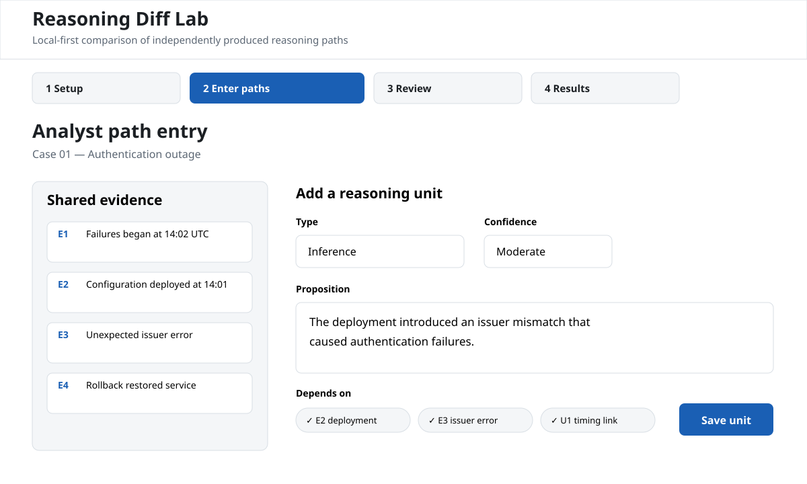
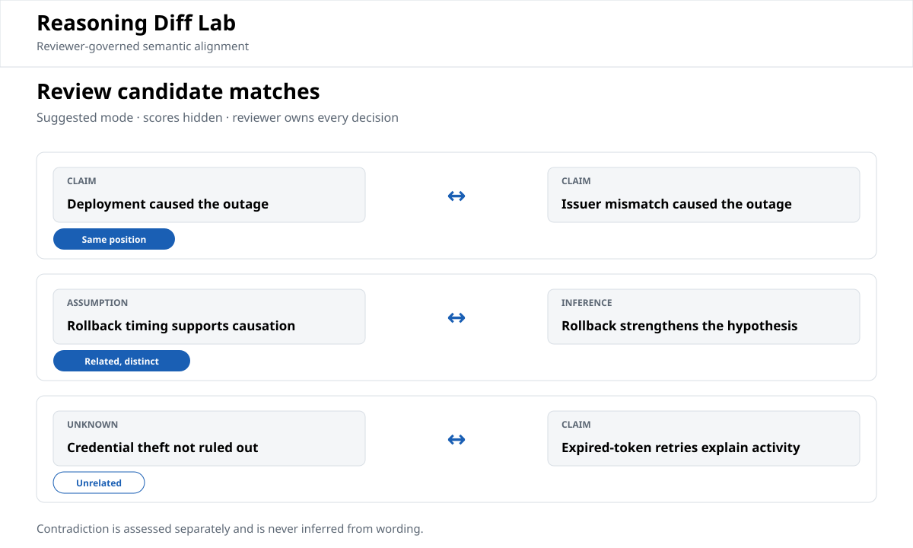
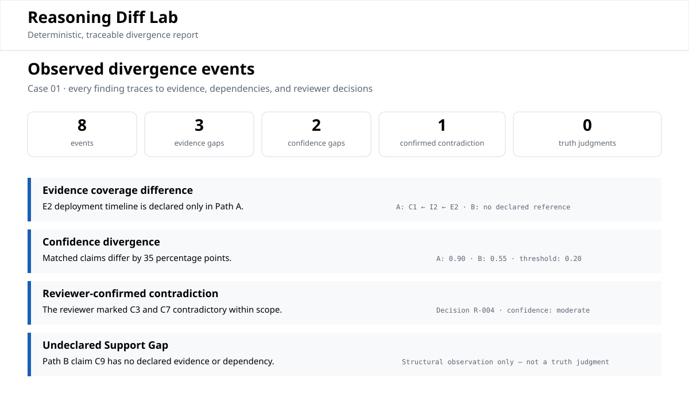
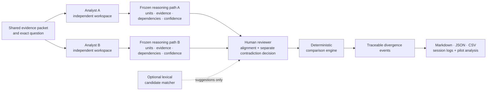

# Reasoning Diff Lab

A local-first research instrument for pilot-testing one hypothesis:

> Comparing two independently produced structured reasoning paths can reveal useful,
> non-obvious divergences that improve analytical review.

**Status: pilot-ready, empirically unvalidated.** No human trial has been run. The shipped
software has 58 passing tests, a reproducible static build, three synthetic cases, and
deterministic reports. Those facts establish internal behavior only. They do **not** establish
usefulness, usability, scientific validity, or market demand. See
[docs/VERIFICATION_REPORT.md](docs/VERIFICATION_REPORT.md) and
[docs/research-assessment-v0.1.md](docs/research-assessment-v0.1.md).

> **Pilot recruitment is open.** The first session needs two independent analysts and one
> reviewer for a roughly 90-minute local test using synthetic evidence only. See
> [Issue #1: Pilot participants wanted](https://github.com/GnomeMan4201/reasoning-diff-lab/issues/1).
>
> The pilot instrument is frozen on [`release/v2.0.0`](https://github.com/GnomeMan4201/reasoning-diff-lab/tree/release/v2.0.0).
> Facilitators should use the [pilot session checklist](docs/PILOT_SESSION_CHECKLIST.md) and
> record deviations rather than changing the instrument mid-session.

## Why this exists

Investigations usually preserve evidence and final conclusions better than the reasoning that
connects them. When two competent people inspect the same evidence and disagree, reviewers are
often left comparing polished reports and reconstructing the analytical split after the fact.

Reasoning Diff Lab makes two independently authored reasoning paths first-class artifacts. A
separate reviewer aligns comparable units, assesses contradiction independently, and then a
deterministic engine reports differences in evidence use, dependencies, confidence, declared
support, and conclusions. The tool does not decide which path is true. It makes the relationship
between the paths inspectable.

## Known limitations

- **No empirical validation yet.** The pilot has not been run with human participants.
- **Structured entry has a real cost.** Recording typed units and dependencies may consume more
  time than the resulting review value justifies.
- **The taxonomy may not fit every investigator.** Observation, assumption, inference, claim,
  and unknown are pilot categories, not a proven universal model of reasoning.
- **Candidate matching is lexical and optional.** Every accepted alignment remains a human
  reviewer decision; wording similarity is never treated as semantic truth.
- **Reviewer judgment affects the output.** Alignment and contradiction decisions are signed
  provenance, not objective ground truth.
- **The current pilot uses synthetic cases.** Ecological validity and real-work adoption remain
  unknown.
- **Local-first is not the same as production-secure.** This prototype has no accounts,
  permissions service, encrypted shared storage, or multi-user deployment model.

The full boundary list is in [docs/LIMITATIONS.md](docs/LIMITATIONS.md).

## Interface previews

These previews mirror the shipped workflow and terminology. They are illustrative repository
assets, not evidence of usability testing.

### Analyst entry



### Reviewer alignment



### Traceable divergence report



## Architecture



The browser interface writes local pilot state. Production modules under `src/` validate the
reasoning model, generate candidate matches, compute deterministic events, and produce reports.
The CLI uses the same modules for comparisons and pilot-level analysis. There is no remote
service and no external runtime dependency.

## What changed from v1

v1 was a working prototype with one synthetic case and no run trials. v2 is the pre-pilot
package: the same narrow engine, hardened and re-scoped around reviewer anchoring, analyst entry
burden, and the difference between "the code runs" and "the hypothesis is supported." See the
scorecard in [docs/DEVELOPER_HANDOFF.md](docs/DEVELOPER_HANDOFF.md).

## Start here

- Volunteering for the pilot? Read
  [Issue #1](https://github.com/GnomeMan4201/reasoning-diff-lab/issues/1).
- New participant in a pilot? Read [QUICKSTART.md](QUICKSTART.md) — under five minutes.
- Facilitating a pilot session? Use the
  [pilot session checklist](docs/PILOT_SESSION_CHECKLIST.md), then read
  [PILOT_RUNBOOK.md](PILOT_RUNBOOK.md) and the
  [one-page facilitator packet](docs/FACILITATOR_PACKET.md).
- Analyst? Read [docs/ANALYST_GUIDE.md](docs/ANALYST_GUIDE.md).
- Reviewer? Read [docs/REVIEWER_GUIDE.md](docs/REVIEWER_GUIDE.md).
- Evaluating the research claim? Read
  [docs/research-assessment-v0.1.md](docs/research-assessment-v0.1.md) and
  [docs/EXPERIMENT_PROTOCOL.md](docs/EXPERIMENT_PROTOCOL.md).
- Developer taking this over? Read [docs/DEVELOPER_HANDOFF.md](docs/DEVELOPER_HANDOFF.md).

## Run it

Requires Node.js 20 or newer. The project has zero runtime dependencies.

```bash
npm test       # 58 tests against the production modules
npm run build  # static build into dist/
npm start      # serves dist/ at http://localhost:4173
npm run verify # test + build + smoke test against the built artifact
```

CLI:

```bash
npm run compare -- \
  --a fixtures/cases/case-01-straightforward/path-a.json \
  --b fixtures/cases/case-01-straightforward/path-b.json \
  --decisions fixtures/cases/case-01-straightforward/reviewer-decisions.json \
  --out reports/case-01.md --json reports/case-01.json --csv reports/case-01.csv

npm run analyze -- fixtures/sample-session.json
```

## Terminology

| Avoided term | Used term | Why |
|---|---|---|
| unsupported reasoning | Undeclared Support Gap | A syntactic fact about what was declared, not a truth judgment |
| equivalent unit | Candidate Match / `same_position` | A suggestion is never verified equivalence |
| inferred contradiction | Reviewer-confirmed contradiction | The engine never infers contradiction from wording |
| truth disagreement | Observed divergence | The engine reports structure, not truth |

See [docs/LIMITATIONS.md](docs/LIMITATIONS.md) for the full rationale.

## Three pilot cases

- `fixtures/cases/case-01-straightforward`
- `fixtures/cases/case-02-ambiguous`
- `fixtures/cases/case-03-noisy`

Each contains a case definition, two reference reasoning paths, golden reviewer decisions, and a
facilitator-only design note that must remain hidden until grading is complete. See
[docs/EXPERIMENT_PROTOCOL.md](docs/EXPERIMENT_PROTOCOL.md) for the full pilot design.

## Verification and scope

The verification package currently establishes:

- 58 passing automated tests and zero failures;
- successful static build;
- smoke execution against the built artifact;
- deterministic event IDs and ordering for the shipped fixtures;
- 22 generated events across the three synthetic cases.

It does not establish that those events are useful, complete, non-misleading, or worth the
capture burden. That is the pilot's job.

## Next step

Do not add scope. Recruit two independent analysts and one uninvolved reviewer, then run the
three included cases from the frozen `release/v2.0.0` branch. Feed the exported session data into
`cli/analyze.js`, compare the result against
[docs/SCORING_RUBRIC.md](docs/SCORING_RUBRIC.md), and record **continue**, **pivot**, **stop**,
or **not yet scoreable**.

Only expand the product after real participant evidence justifies it.

## License

[MIT](LICENSE)
