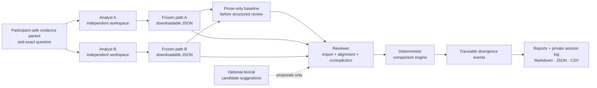

# Reasoning Diff Lab

A local-first research instrument for pilot-testing one hypothesis:

> Comparing two independently produced structured reasoning paths can reveal useful, non-obvious divergences that improve analytical review.

**Status: pilot-ready candidate, empirically unvalidated.** The deterministic engine, reports, and included fixtures are internally verified. No completed human pilot establishes usefulness, usability, scientific validity, or demand.

> **Pilot recruitment is open, but do not schedule a session until v2.0.1 is frozen and the host-machine rehearsal passes.** Volunteer through [Issue #1](https://github.com/GnomeMan4201/reasoning-diff-lab/issues/1).
>
> The final pilot instrument will be frozen on [`release/v2.0.1`](https://github.com/GnomeMan4201/reasoning-diff-lab/tree/release/v2.0.1). Facilitators must complete the [pre-pilot readiness audit](docs/PRE_PILOT_READINESS_AUDIT.md), [session checklist](docs/PILOT_SESSION_CHECKLIST.md), and [runbook](PILOT_RUNBOOK.md).

## Why this exists

Investigations preserve evidence and final conclusions more reliably than the assumptions, alternatives, confidence changes, and dependency chains that connect them. When two competent people inspect the same evidence and disagree, reviewers often compare polished conclusions and reconstruct the analytical split after the fact.

Reasoning Diff Lab makes two independently authored reasoning paths inspectable artifacts. A separate reviewer aligns comparable units, assesses contradiction independently, and a deterministic engine reports differences in evidence use, dependencies, confidence, declared support, and conclusions. The tool does not decide which path is true or which analyst is better.

## Known limitations

- No human pilot has established usefulness.
- Structured entry may cost more time than the review value it creates.
- Observation / assumption / inference / claim / unknown is a pilot taxonomy, not a universal model of thought.
- Candidate matching is lexical and optional; every alignment remains a reviewer decision.
- Reviewer judgment affects the output and is preserved as provenance, not objective ground truth.
- The three pilot cases are synthetic and the reference paths are public; volunteers must be screened for prior exposure.
- One analyst pair and one reviewer cannot support general population claims.
- Local-first is not production-secure multi-user infrastructure.

See [docs/LIMITATIONS.md](docs/LIMITATIONS.md) and [docs/PRE_PILOT_READINESS_AUDIT.md](docs/PRE_PILOT_READINESS_AUDIT.md).

## v2.0.1 pilot-safety corrections

The deeper browser-workflow audit found defects that deterministic engine tests could not catch. v2.0.1 adds:

- participant-safe evidence packets with no facilitator design notes;
- a separate non-pilot training demo;
- analyst-to-reviewer path download/import with role, case, question, and evidence validation;
- analyst role guards that prevent early reviewer-screen exposure;
- a real local reset control;
- baseline-before-tool enforcement;
- correct accepted/rejected suggestion logging;
- baseline and tool reviewer timing export;
- raw path preservation in private session logs;
- loopback-only server binding by default;
- 65 automated tests, expanded built-artifact smoke checks, and GitHub Actions verification.

The patch does **not** change the taxonomy, matcher weights, engine rules, event catalog, scoring thresholds, analysis formulas, or pilot questions.

## Interface previews

These previews illustrate the workflow; they are not usability evidence.

### Analyst entry


### Reviewer alignment


### Traceable divergence report


## Architecture



The browser stores pilot state locally. Separate analyst devices can export frozen path JSON files for private import into the reviewer browser. No external service receives typed reasoning.

## Start here

- Participant: [QUICKSTART.md](QUICKSTART.md)
- Facilitator: [PILOT_RUNBOOK.md](PILOT_RUNBOOK.md)
- Pre-pilot go/no-go: [docs/PRE_PILOT_READINESS_AUDIT.md](docs/PRE_PILOT_READINESS_AUDIT.md)
- Short checklist: [docs/PILOT_SESSION_CHECKLIST.md](docs/PILOT_SESSION_CHECKLIST.md)
- Coordination: [docs/PILOT_COORDINATION.md](docs/PILOT_COORDINATION.md)
- Analyst guide: [docs/ANALYST_GUIDE.md](docs/ANALYST_GUIDE.md)
- Reviewer guide: [docs/REVIEWER_GUIDE.md](docs/REVIEWER_GUIDE.md)
- Research protocol: [docs/EXPERIMENT_PROTOCOL.md](docs/EXPERIMENT_PROTOCOL.md)
- Scoring rules: [docs/SCORING_RUBRIC.md](docs/SCORING_RUBRIC.md)
- Data contracts: [docs/DATA_DICTIONARY.md](docs/DATA_DICTIONARY.md)
- Research assessment: [docs/research-assessment-v0.1.md](docs/research-assessment-v0.1.md)

## Run it

Requires Node.js 20 or newer and has zero runtime dependencies.

```bash
npm run verify # tests + static build + built-artifact safety smoke test
npm start      # serves on http://127.0.0.1:4173 by default
```

Other commands:

```bash
npm test
npm run build

npm run compare -- \
  --a fixtures/cases/case-01-straightforward/path-a.json \
  --b fixtures/cases/case-01-straightforward/path-b.json \
  --decisions fixtures/cases/case-01-straightforward/reviewer-decisions.json \
  --out reports/case-01.md --json reports/case-01.json --csv reports/case-01.csv

npm run analyze -- fixtures/sample-session.json
```

## Pilot flow

1. Train only with `demo-training`.
2. Analysts inspect the same participant-safe evidence packet independently.
3. Each analyst freezes a path; download it if a different browser/device will be used.
4. Reviewer/facilitator imports both paths.
5. Reviewer completes and times the plain prose-only baseline first.
6. Reviewer opens the assigned structured review mode, aligns units, and assesses contradiction separately.
7. Generate and grade every event; record important missed divergences.
8. Export raw paths, reports, session logs, questionnaires, and deviations privately.
9. Run the predefined analysis and record continue, pivot, stop, or not yet scoreable.

## Verification boundary

Verification establishes internal behavior only:

- 65 automated tests in the v2.0.1 candidate;
- reproducible static build;
- smoke execution against the built artifact;
- deterministic event IDs and ordering for included fixtures;
- participant packet integrity and absence of design-note leakage;
- presence of demo separation, role guards, transfer controls, baseline gate, reset control, and rejection logging.

It does not establish that findings are useful, complete, non-misleading, or worth the capture burden. That is the pilot's job.

## License

[MIT](LICENSE)
